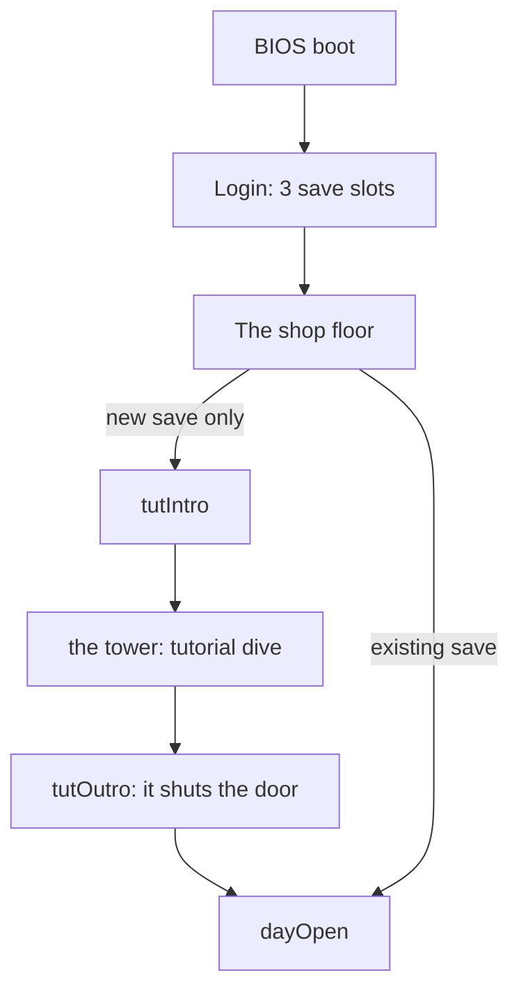
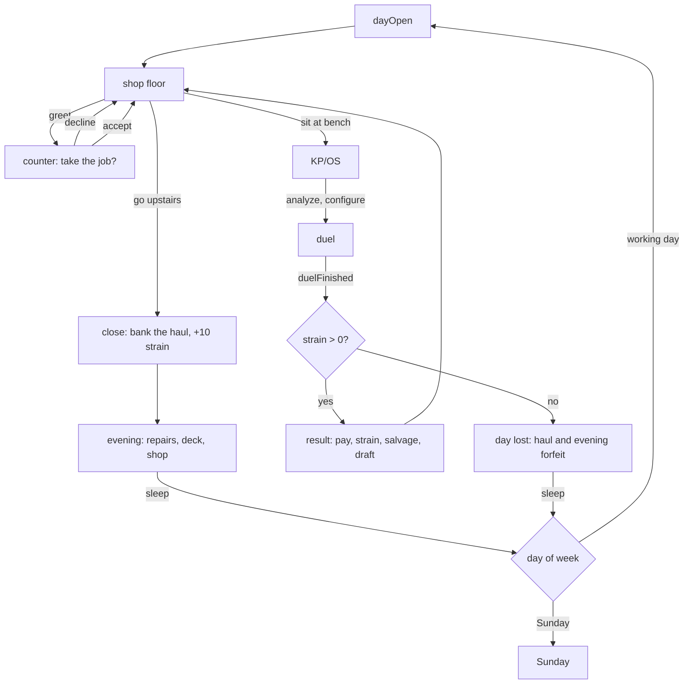
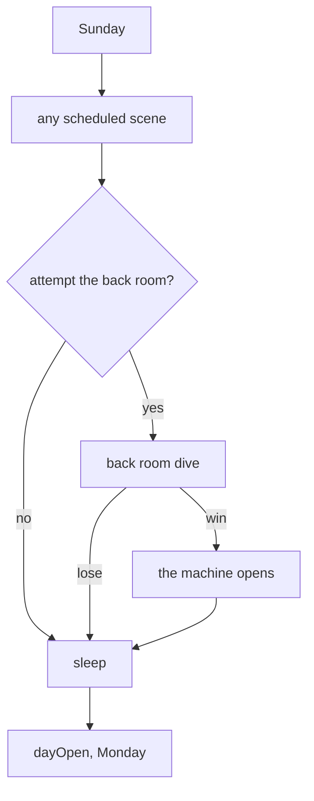

# Game flowchart

> [!warning] status: draft
> The shipped state machine is `save.ts:RunScreen` and the `run-reducer.ts` transitions, which still describe the ten-day run. What follows is the machine the redesign needs.

## Boot to the first day

## The working day

## Sunday

## What changed in the machine

- **`runEnd` is deleted.** Strain 0 no longer terminates anything; it routes to a lost day and then to sleep like any other night.
- **`finalePre` becomes a Sunday branch** rather than a day 10 replacement for the job board, and a win returns to Monday instead of ending the game.
- **The day has no fixed length.** There is no "3 tickets done?" test, only the player choosing the stairs.
- **The shop floor is a state**, and it is the state the player returns to after everything.
- `build` was already vestigial: the cut mandatory build stop. See [[design-change-log]].

## Two things the diagram does not show

**Refresh is a safe abort**, and that is now a problem worth solving rather than a feature: reloading out of a dive the player is losing would protect the day's haul. See [[save-and-load]].

**The evening does not commit until you sleep.** Everything in it trades against everything else, so nothing is final while the player is still standing up. See [[the-night-shop]].

## See also

- [[core-loop]] · [[kp-os]]
